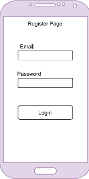
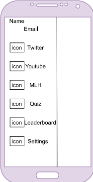

# Dev Central

## Contents

- [Dev Central](#dev-central)
  - [Contents](#contents)
- [dsw-semester2-project](#dsw-semester2-project)
- [Group Members](#group-members)
- [Group Member Tasks](#group-member-tasks)
- [How to install](#how-to-install)
- [Documentation](#documentation)
  - [Tools used to build your application](#tools-used-to-build-your-application)
  - [Explanation of how these tools are integrated](#explanation-of-how-these-tools-are-integrated)
  - [Narratives](#narratives)
  - [Explanation of our Database and UML Diagram](#explanation-of-our-database-and-uml-diagram)
  - [Screen dumps of the application](#screen-dumps-of-the-application)
- [Light Mode](#light-mode)
- [Dark Mode](#dark-mode)
  - [Mockups](#mockups)
  - [Screen Flows](#screen-flows)
  - [Use Cases](#use-cases)
  - [Application Requirements](#application-requirements)
  - [Problem Statement](#problem-statement)
  - [Problem Objective](#problem-objective)
  - [Proposed Solution](#proposed-solution)
  - [Solution Design](#solution-design)

# dsw-semester2-project

---

# Group Members

Tiiso Senosha - 220003917 - theotiiso@gmail.com

Lesego Temane - 219081209 - lesegogtemane@gmail.com

Waaiez Kinnear - 219021671 - waaiez.kinnear10@gmail.com

Alexis Makgeru - 220042401 - sebotsealexis@gmail.com

Bonginkosi Nhantumbo - 217040604 - bonginkosi.li73@gmail.com

Blessing Leso - 219089394 - blessingitlotlengleso@gmail.com

# Group Member Tasks

Tiiso Senosha - Quiz Leaderboard, Styling

Lesego Temane - MLH Cards, Styling

Waaiez Kinnear - Quiz, Settings, Database Setup

Alexis Makgeru - Twitter Cards, Styling

Bonginkosi Nhantumbo - Login Page, Register Page, Update Password Page, Styling

Blessing Leso - YouTube Cards, Styling

# How to install

First you need NodeJS and the Ionic CLI installed.
Android Studio and/or xCode will also need to be installed in order to build the mobile application counterparts.

Once installed and working you can clone this repo with the following command
`git clone https://github.com/Making-Updates/DSW-second-semester-project.git`

After the repo has been cloned you need to open a terminal window (Powershell) inside the folder and run the following command
`npm install`

This will install all the required dependencies.

After the dependencies are installed you are ready to start the application.

Run the following command to start the application
`ionic serve`

Look in your terminal output and you will see the line
`Listening on Port XXXX`
Where `XXXX` is a number.

Once you have the Port number you can navigate to
`localhost:XXXX/`

In order to build the application for a specific platform you need to run one of the following commands:
`ionic capacitor add android` or `ionic capacitor add ios`

The above command will create the initial files needed to build an app for the specific platform. Run the following command to ensure that your project files are synced for the platform you want to build for:
`ionic capacitor copy android` or `ionic capacitor copy ios`

After the files have sync you can open either Android Stuido or xCode to build the application.

# Documentation

## Tools used to build your application

-   React
-   React Bootstrap
-   Ionic
-   Capacitor
-   Capacitor Network
-   Supabase
-   Axios

## Explanation of how these tools are integrated

-   React is used to build our User Interface
-   React Bootstrap is used to style our User Interface
-   Ionic is used to create a cross-platform application for Android and the Web
-   Capacitor is used by Ionic as the runtime
-   Capacitor Network is used check for network changes
-   Supabase is our database provider
-   Axios is used to make http requests to our backend API

## Narratives

<b> How users uses our app </b>

A user registers an account on our app to access tutorials, hackathons, software development news and compete with other programmers by taking quizzes. There is a leaderboard where the players can see their ranking.

On the FreeCodeCamp YouTube page:

1. A user is presented with the latest tutorials from freeCodeCamp.org Youtube channel
2. They click on a video that interests them the most.
   3.They are then redirected to youtube where they learn the technology.

On the FreeCodeCamp Twitter page:

1. A user is presented with the latest news from freeCodeCamp.org Twitter page.
2. They click on a tweet that interests them the most.
3. They are then redirected to the freeCodeCamp.org blog in the browser.
4. Through those blog posts they keep themselves knowledgeable about the IT world.

On the MLH Hackathons page:

1. A user is presented with the latest Hackathon events from MLH.io website
2. They click on a event that interests them the most.
3. They are then redirected to a page in the browser where they read more about the event and register to participate.
4. They stand a chance to network with other tech enthusiasts and win prizes.

On the Quiz page:

1. You are presented with three(3) categories to choose from.
2. You choose the subject and the difficulty level.
3. Take the quiz.
4. When you are done you have the option to view your ranking on the leaderboard.

<b>Why our mobile app is necessary to achieve certain goals</b>

Tech enthusiasts use our app to easily find toturials that will teach them how to complete programming tasks, access information easily and cut down on the time that they would rather be spending hopping from one source to another.

## Explanation of our Database and UML Diagram

  

Our database contains the following tables:

<h3>Authentication</h3>
- This table contains user login details. When a user registers their account we store their credentials here,namely userID and Email address, and retrieve them later when they sign in

<h3>Scores</h3>
- The scores table contains the score details of users. When a user has finished taking a quiz we store their email address, the category of the quiz that they took and the difficulty level of their quiz. We then retrieve and display their details on the leader scoreboard together with their ranking. 

## Screen dumps of the application

# Light Mode

# Dark Mode

## Mockups

## Screen Flows

Our application requires users to log in before they can use the app. They will be redirected to the Login Page if they are not logged in.

On the Login Page users can either log in, go to the Register Page.

-   When a user logs in they will be redirected to the Home Page (MLH page).

On the Register Page users can register using an email address and password. Once registered they will be redirected to the Login Page so they can log in.

On the Home (MLH) Page users will be able to see information about upcoming hackathons.

On the Twitter Page users will see the latest tweets from FreeCodeCamp.

On the Youtube Page users will see the latest videos from FreeCodeCamp.

On the Quiz Page users will be able to participate in a quiz and they will have an option to save their score at the end.

On the Quiz Leaderboard Page users will be able to see the top scores saved in the database.

On the Settings Page users will be able to sign out and lock the app with their fingerprint.

## Use Cases

-   Who is using the application
    -   People interested in Software Development
    -   Developers looking for tutorials.
    -   People looking for the next hackathon.
-   What the user want to do
    -   To take the quiz inside the app.
    -   To find the latest tutorials.
    -   To find the latest news articles.
    -   To find the latest hackathons.
-   The user's goal
    -   To entertain themselves.
    -   To polish their skills.
    -   To find out about the latest programming technologies.

## Application Requirements

-   [x] Side bar with all the pages
-   [x] MLH page with latest Hackathons
-   [x] Twitter page with latest tweets
-   [x] Youtube page with latest videos
-   [x] Quiz page allowing user to take a quiz
-   [x] Quiz Leaderboard page with top scores
-   [x] Settings page with signout button
-   [ ] Settings page with setting to lock the app with your fingerprint

## Problem Statement

People with an intetest for software development often don't know where to start looking for tutorials, quizzes to evaluate their knowledge of programming, latest news on software development and hackathons to participate in.

## Problem Objective

Our app is one that solves the problem of simplifying ones life in terms of accessing information about the programming world by consolidating information into one app.

## Proposed Solution

We have developed a mobile application where users can view the latest hackathons taking place, view the latest news published by freecodecamp.org, find the latest tutorials taught by professional developers and take quizzes to improve their knowledge.

## Solution Design

!fill in later
